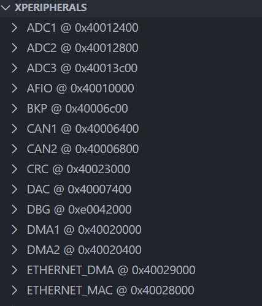

# 软件准备
1. [stm32cubeMX](https://www.st.com/en/development-tools/stm32cubemx.html#get-software)
	note：需要java。
	stm32配置代码生成器。
2. [MSYS2](https://www.msys2.org/#installation)
	* cmake:`pacman -S mingw-w64-ucrt-x86_64-cmake
	* make:`pacman -S mingw-w64-ucrt-x86_64-make`
	* openocd:`pacman -S mingw-w64-ucrt-x86_64-openocd`
	**note**:cmake/make为编译链工具，openocd为调式器工具。将`ucrt64/bin`加入环境变量。
	
3. [arm-none-eabi-gcc](https://developer.arm.com/downloads/-/arm-gnu-toolchain-downloads)
	编译工具选择：

	对于stm32裸机开发选，Windows (mingw-w64-i686) hosted cross toolchains/AArch32 bare-metal target (arm-none-eabi)条目下的zip文件下载。
# 开始第一个工程
## cubeMX端
1. 下载系列芯片对应的HAL库
2. 创建项目
	参照[文档](https://www.cnblogs.com/jzcn/p/16313803.html)
3. 生成代码
	note:toolchain选择camke
## vscode端
## 编写自定义代码
### 生成makefile，编译代码生成`.elf`文件
```shell
mkdir build
cd build
cmake ..
mingw32-make
```
### 烧录`.elf`
```shell
openocd \
-f interface/stlink-v2.cfg \
-c "set CPUTAPID 0x2ba01477" \
-f target/stm32f1x.cfg \
-c "program E:/mcu_keil/mcu_code_box/HAL/f103c8t6/cmake_template/build/cmake_template.elf verify reset exit"
```
+  **openocd**
    - 启动 Open On-Chip Debugger 程序
    - 这是一个开源的调试工具，用于嵌入式设备的编程和调试
+ **-f interface/stlink-v2.cfg**
    - `-f` 参数用于指定配置文件
    - `interface/stlink-v2.cfg` 是 ST-Link V2 调试器的配置文件
    - 定义了如何与 ST-Link 硬件通信
+  **-c "set CPUTAPID 0x2ba01477"**
    - `-c` 参数用于执行一个 OpenOCD 命令
    - `set CPUTAPID 0x2ba01477` 设置目标芯片的 TAP ID
    - 这里是为了解决克隆或特定芯片的 ID 识别问题(解决盗版芯片问题)
+  **-f target/stm32f1x.cfg**
    - 指定目标芯片的配置文件
    - `target/stm32f1x.cfg` 包含 STM32F1 系列芯片的配置
+  **-c "program ... verify reset exit"**
    - `program` 执行烧录操作
    - 后面是要烧录的 ELF 文件完整路径
    - `verify` 烧录后验证内存内容是否正确
    - `reset` 烧录完成后重置芯片
    - `exit` 操作完成后退出 OpenOCD
**note**：openocd usage
```shell
--help       | -h       display this help
--version    | -v       display OpenOCD version
--file       | -f       use configuration file <name>
--search     | -s       dir to search for config files and scripts
--debug      | -d       set debug level to 3
             | -d<n>    set debug level to <level>
--log_output | -l       redirect log output to file <name>
--command    | -c       run <command>
```
### 解决vscode无法识别头文件
 + 打开目录下任以c文件，在vscode底部状态栏右下角处点击win32，创建c_cpp_properties.json
 + 修改c_cpp_properties.json
```json
	{
    "configurations": [
        {
            "name": "Win32",
            "includePath": [
                "${workspaceFolder}/**"
            ],
            "defines": [
                "_DEBUG",
                "UNICODE",
                "_UNICODE",
                "USE_HAL_DRIVER ",
                "STM32F103xB"
            ],
            "compilerPath": "D:\\arm-gnu-toolchain\\bin\\arm-none-eabi-gcc.exe",
            "cStandard": "c11",
            "cppStandard": "gnu++17",
            "intelliSenseMode": "gcc-arm",
		}
    ],
    "version": 4
}
```

**note**:在define处添加`"USE_HAL_DRIVER"`, `"STM32F103xB"`关键句。该句可在项目文件`cmake\stm32cubemx\CMakeLists.txt`中`set`()中找到，修改编译器路径`"compilerPath"`，修改代码提示类型 `"intelliSenseMode"`为`gcc-arm`
## 编译下载与调试
### 编写脚本一键编译下载
```shell
# 获取当前脚本所在目录
SCRIPT_DIR=$(dirname "$(realpath "$0")")  

# 从当前目录开始，向上查找直到找到 CMakeLists.txt 文件，确定项目根目录
PROJECT_DIR=$SCRIPT_DIR
while [ ! -f "$PROJECT_DIR/CMakeLists.txt" ]; do
    PROJECT_DIR=$(dirname "$PROJECT_DIR")
done

# 获取项目根目录名
PROJECT_NAME=$(basename "$PROJECT_DIR")  

echo "Project root directory name: $PROJECT_NAME"  

# 删除原有的构建目录
BUILD_DIR="$PROJECT_DIR/build"
if [ -d "$BUILD_DIR" ]; then
    rm -rf "$BUILD_DIR"
fi

# 创建并进入构建目录
mkdir -p "$BUILD_DIR"
cd "$BUILD_DIR"
  
# 运行 CMake 配置和编译项目
cmake ..
mingw32-make -j 12  

# 根据项目名称生成 ELF、BIN 和 HEX 文件路径
ELF_FILE="$BUILD_DIR/${PROJECT_NAME}.elf" BIN_FILE="$BUILD_DIR/${PROJECT_NAME}.bin" HEX_FILE="$BUILD_DIR/${PROJECT_NAME}.hex"
  
# 检查 ELF 文件是否生成成功
if [ -f "$ELF_FILE" ]; then
# 将 ELF 文件转换为 BIN 文件和 HEX 文件
    arm-none-eabi-objcopy -O binary "$ELF_FILE" "$BIN_FILE"
    arm-none-eabi-objcopy -O ihex "$ELF_FILE" "$HEX_FILE"
    echo "Conversion to BIN and HEX completed."
else
    echo "Error: ELF file not found. Compilation might have failed."
    exit 1
fi

# 删除ELF、BIN 和 HEX 文件之外的所有文件和文件夹
find "$BUILD_DIR" -type f ! -name "${PROJECT_NAME}.elf" ! -name "${PROJECT_NAME}.bin" ! -name "${PROJECT_NAME}.hex" -delete
find "$BUILD_DIR" -type d -empty -delete

# 对于大型项目建议编译和烧录分开
# 执行 OpenOCD 进行烧录
cd .. 
# 回到项目根目录可能有助于路径解析
openocd \
-f interface/stlink.cfg \
-c "set CPUTAPID 0x2ba01477" \
-f target/stm32f1x.cfg \
-c "program build/${PROJECT_NAME}.hex verify reset exit"
```
**note**:若分开需编写烧录cfg
```cfg
# 查找仿真器
source [find interface/stlink-dap.cfg] 
# 查找芯片
set CPUTAPID 0x2ba01477
source [find target/stm32f1x.cfg]

program E:\mcu_keil\mcu_code_box\HAL\f103c8t6\cmake_template\build\cmake_template.hex.hex verify reset exit
```
### 调试
1. 下载插件
	vscode安装cortex-debug 插件
2. 添加调试文件launch.json
	**note**:可以选择调试配置

```json
{
    // 使用 IntelliSense 了解相关属性。
    // 悬停以查看现有属性的描述。
    // 欲了解更多信息，请访问: https://go.microsoft.com/fwlink/?linkid=830387

    "version": "0.2.0",
    "configurations": [
        {
            "cwd": "${workspaceRoot}",
            "executable": "${workspaceRoot}/build/${workspaceFolderBasename}.elf",
            "name": "Debug with OpenOCD",
            "request": "launch",
            "type": "cortex-debug",
            "servertype": "openocd",
            "configFiles": [
                "interface/stlink.cfg",
                 // "target/stm32f1x.cfg",
                "${workspaceRoot}/.vscode/my_stm32f1.cfg"
            ],
            "searchDir": [],
            "runToEntryPoint": "main",
            "showDevDebugOutput": "none",
            "svdFile": "E:/mcu_keil/svd_box/STM32F103.svd"
        }
    ]
}
```
**note**:
* `"executable"`,修改为可运行程序处（.hex/.bin/.elf）；
* `"configFiles"`,添加芯片cfg，和仿真器cfg，特别注意对于非官方的魔改版本需要修改芯片cfg指定芯片ip；
* `"svdFile"`,添加svd，以查看寄存器变化。
```
```cfg
# 自定义 OpenOCD 配置文件
# 设置特殊芯片 ID
set CPUTAPID 0x2ba01477

# 然后加载标准 STM32F1 配置
source [find target/stm32f1x.cfg]
```
3. 添加寄存器查看
	+ 下载[svd](https://www.st.com.cn/content/st_com/zh/search.html#q=svd-t=resources-page=1)文件
	+ 在调试处，xperipherals方可查看寄存器

## 串口打印
## uart内添加代码
```c
int _write(int fd, char *pBuffer, int size)
{
    // 避免串口发送过程中的死循环，加入超时机制
    const uint32_t timeout = 100000;  // 超时周期，假设最多等待 100,000 次
    uint32_t timeout_counter = 0;
    
    for (int i = 0; i < size; i++)
    {
        // 等待直到串口的数据寄存器空
        while ((USART1->SR & 0x40) == 0)    //修改成你的串口
        {
            timeout_counter++;
            if (timeout_counter >= timeout)
            {
                // 如果超过超时限制，可以跳出并返回错误，或者做其他处理
                return -1;  // 返回错误
            }
        }
        USART1->DR = (uint8_t) pBuffer[i];  // 写入数据寄存器，发送字符
    }
    
    return size;  // 返回成功发送的字符数量
}
```
## gcc-arm-none-eabi.cmake内添加代码
```cmake
# 有中文注释的部分，是cubemx不会自动生成的，需要手动添加
set(CMAKE_C_LINK_FLAGS "${CMAKE_C_LINK_FLAGS} -u _printf_float")  # 支持 printf 函数打印浮点数
set(CMAKE_C_LINK_FLAGS "${CMAKE_C_LINK_FLAGS} -lm")  # 链接数学库 libm
set(CMAKE_EXE_LINKER_FLAGS "-Wl,--gc-sections,--no-warn-rwx-segments")  # 取消 rwx 段的警告
set(CMAKE_C_FLAGS "${CMAKE_C_FLAGS} -Wno-unused-parameter")  # 忽略 C 代码中未使用参数的警告
set(CMAKE_CXX_FLAGS "${CMAKE_CXX_FLAGS} -Wno-unused-parameter")  # 忽略 C++ 代码中未使用参数的警告

```